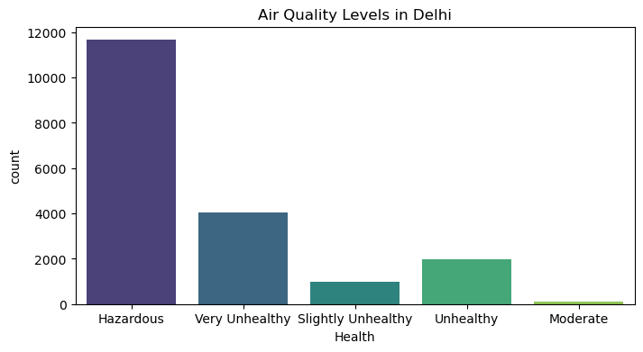
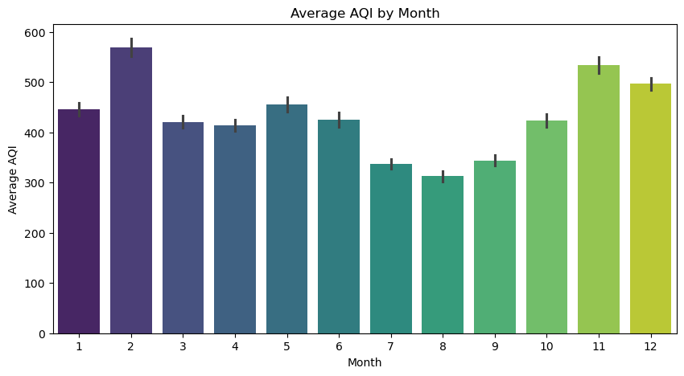
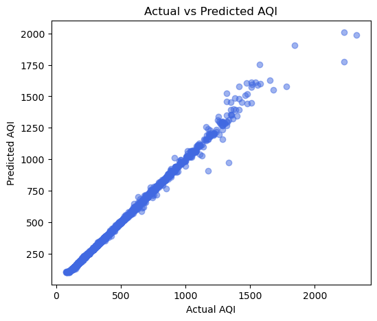

# AirQualityIndex

**Delhi Air Quality Index (AQI) Calculation, EDA, and Regression Modeling**

**Dataset Link:** [Kaggle – Delhi Air Quality](https://www.kaggle.com/datasets/deepaksirohiwal/delhi-air-quality)

### Project Overview

- Developed a **methodology to calculate the Air Quality Index (AQI)** from hourly pollutant values (`PM2.5`, `PM10`, `NO2`, `O3`, `CO`, `SO2`, `NH3`, etc.) and assigned **health labels** (`Good`, `Moderate`, `Unhealthy`, etc.) based on standard guidelines.  
- Performed **Exploratory Data Analysis (EDA)** to understand seasonal, monthly, and daily trends in Delhi’s air quality, revealing higher pollution in **winter and autumn**, with PM2.5 as the most severe pollutant.  
- Constructed a **predictive regression model** using **Random Forest Regressor** to forecast AQI values, leveraging insights from EDA and cleaned, preprocessed data.  
- Evaluated model performance on **previously unseen test data** (year 2023), achieving **robust predictions** with an accuracy of approximately **82%**, showing strong alignment between predicted and actual AQI values.  

### Key Achievements

- **Automated AQI Calculation:** Converts raw pollutant concentrations into a standardized AQI value and corresponding health category.  
- **Predictive Insights:** Provides early warnings for high pollution days through AQI predictions.  
- **Data-Driven Analysis:** Identified key patterns in air quality across seasons, months, and weekdays vs weekends.  
- **Visualization & Reporting:** Created intuitive plots for AQI distribution, average AQI by month, and model prediction accuracy.  

This project demonstrates the **end-to-end process** of data preprocessing, AQI computation, visualization, and predictive modeling for environmental monitoring in Delhi.

